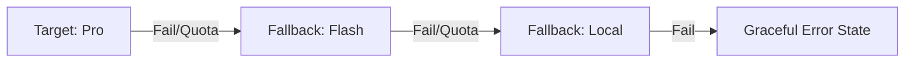

# System Architecture: Hybrid AI Router 🏗️

This document outlines the architectural design and engineering decisions behind the **Hybrid AI Router**. This system is designed to be a cost-effective, high-availability bridge between local and cloud-based Large Language Models.

---

## 1. Design Philosophy

The core objective is to achieve **Intelligence-on-Demand** while minimizing token costs and latency. We follow three primary principles:
1. **Local-First**: Whenever a task can be handled by a local model (Gemma 2 9B), it stays local. This ensures privacy and zero cost.
2. **Semantic Awareness**: We use vector embeddings to "understand" the complexity of a prompt rather than relying on brittle keyword matching.
3. **Resilience (Circuit Breaker)**: The system assumes external APIs *will* fail or be throttled and includes automatic fallback paths.

---

## 2. Component Stack

| Component | Technology | Role |
| :--- | :--- | :--- |
| **Orchestrator** | Python 3.10+ | The "Brain" that handles logic and routing. |
| **Local Inference** | Ollama | Runs Gemma 2 9B and Nomic-Embed-Text locally. |
| **Cloud Inference** | Google Gemini API | Provides Pro and Flash tiers for complex tasks. |
| **Vector Engine** | NumPy | Calculates Cosine Similarity for semantic classification. |
| **Containerization** | Docker Compose | Ensures environment parity and simplified deployment. |

---

## 3. The Routing Logic (Semantic RAG)

Routing is determined by comparing the user's prompt against **Anchor Vectors**—pre-defined "ideal" queries for each intelligence tier.

### The Classification Flow:
1. **Embedding**: The user prompt is converted into a vector using `nomic-embed-text`.
2. **Similarity Analysis**: We calculate the **Cosine Similarity** between the prompt vector and the centroids of our three tiers:
   - **Tier 2 (Pro)**: High-complexity reasoning.
   - **Tier 1 (Flash)**: Technical/Coding tasks.
   - **Tier 0 (Local)**: General conversation.
3. **Thresholding**:
   - `Similarity > 0.65` → **Gemini Pro**
   - `Similarity > 0.60` → **Gemini Flash**
   - `Default` → **Local Gemma 2**

---

## 4. Fault Tolerance & Fallback Chain

To ensure 100% availability, the system implements a recursive fallback strategy:

---

## 5. Security & Secret Management

- **API Security**: Keys are never hardcoded. They are loaded from a dedicated `secrets/` directory which is strictly ignored by Git.
- **Network Isolation**: Docker containers are placed on a private bridge network (`ai-network`), exposing only the necessary ports to the host.

---

## 6. Future Roadmap

- [ ] **Adaptive Thresholding**: Using reinforcement learning to adjust similarity thresholds based on user feedback.
- [ ] **Multi-Model Local Support**: Dynamically switching between Llama 3, Mistral, and Gemma based on task type.
- [ ] **Semantic Caching**: Storing prompt-response pairs in a local vector database to prevent redundant LLM calls.
