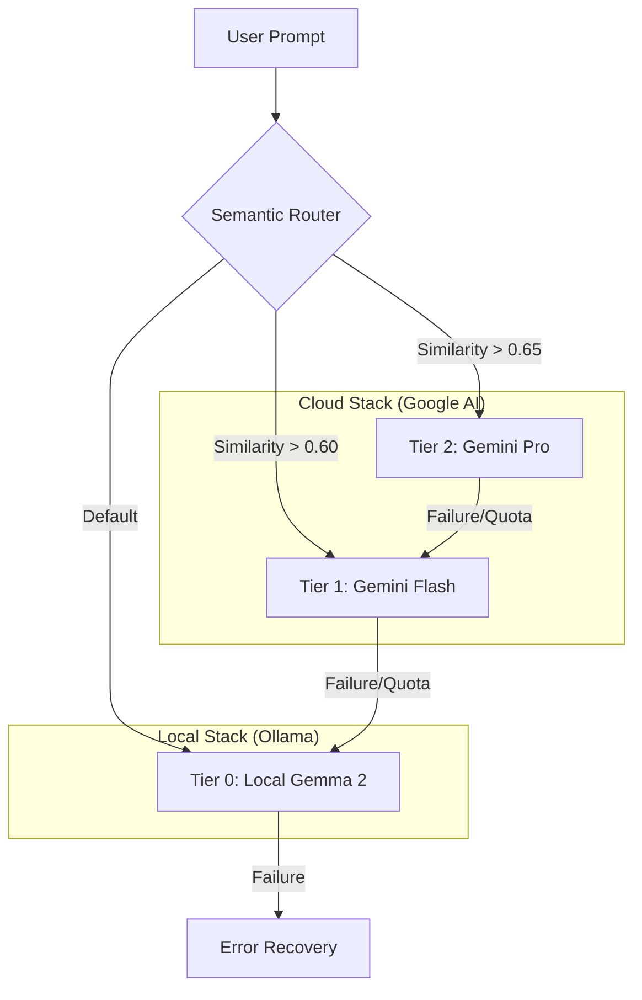

# Hybrid AI Router: Semantic RAG Orchestration 🧠⚡🏠

[](https://opensource.org/licenses/MIT)
[](https://www.python.org/downloads/)
[](https://www.docker.com/)

An intelligent, production-grade AI routing engine that dynamically orchestrates tasks between **local LLMs (Gemma 2)** and **cloud providers (Google Gemini)** using Semantic RAG and Vector Embeddings.

---

## 📖 Overview

The **Hybrid AI Router** is designed to maximize cost-efficiency and performance by intelligently delegating tasks. It uses a semantic classifier to understand the complexity of a user prompt and routes it to the most appropriate "tier" of intelligence.

### The Problem
Cloud LLMs (like Gemini Pro) are powerful but expensive and have latency overhead. Local LLMs (like Gemma 2 9B) are fast and free but limited in reasoning depth.

### The Solution: Semantic Tiering
We use **Vector Search (Cosine Similarity)** against "Anchor Vectors" to determine task complexity in real-time.
- **Tier 2 (Pro)**: Complex reasoning, architecture, deep analysis.
- **Tier 1 (Flash)**: Technical tasks, coding, structured data.
- **Tier 0 (Local)**: General queries, greetings, low-stakes text generation.

---

## 🏗️ Architecture



---

## 🚀 Key Features

- **Semantic Routing**: Real-time vector embedding analysis using `nomic-embed-text`.
- **Circuit Breaker Pattern**: Graceful fallback logic ensures 100% availability even if cloud APIs or local services fail.
- **Quota Management**: Intelligent tracking to stay within free-tier limits.
- **Containerized Deployment**: Fully orchestrated with Docker Compose for "one-click" startup.
- **Telegram Integration**: Mobile access to your private AI brain.

---

## 🛠️ Tech Stack

- **Core**: Python 3.10+
- **Orchestration**: Docker & Docker Compose
- **Local Intelligence**: Ollama (Gemma 2 9B)
- **Cloud Intelligence**: Google Gemini API (Pro & Flash)
- **Vector Math**: NumPy (Cosine Similarity)
- **Interface**: Open WebUI & Telegram Bot API

---

## 🚦 Getting Started

### Prerequisites
- [Docker Desktop](https://www.docker.com/products/docker-desktop/)
- [Ollama](https://ollama.com/) (running `gemma2:9b` and `nomic-embed-text`)
- Google Gemini API Key

### Installation

1. **Clone the repository**:
   ```bash
   git clone https://github.com/your-username/hybrid-ai-router.git
   cd hybrid-ai-router
   ```

2. **Configure Secrets**:
   Copy `.env.example` to `.env` and fill in your keys:
   ```bash
   cp .env.example .env
   # Or create secrets/gemini_api_key.txt
   ```

3. **Spin up the stack**:
   ```bash
   docker-compose up -d
   ```

---

## 🛡️ Security & Privacy

- **Secrets Management**: Sensitive keys are loaded from ignored files or environment variables.
- **Data Sovereignty**: Simple queries never leave your local machine, keeping your most personal data private.

---

## 📄 License

Distributed under the MIT License. See `LICENSE` for more information.

---

**Built with ❤️ for the future of Local-First AI.**
