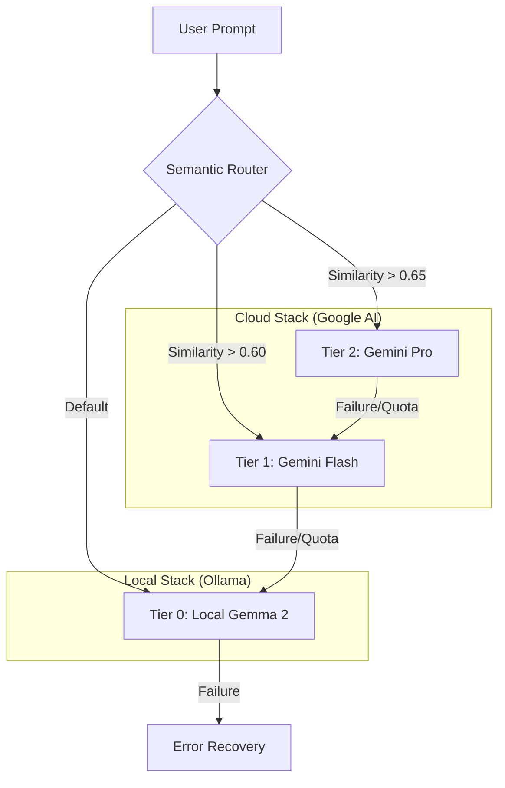

# Hybrid AI Router: Semantic RAG Orchestration 🧠⚡🏠

[](https://opensource.org/licenses/MIT)
[](https://www.python.org/downloads/)
[](https://www.docker.com/)

An intelligent, production-grade AI routing engine that dynamically orchestrates tasks between **local LLMs (Gemma 2)** and **cloud providers (Google Gemini)** using Semantic RAG and Vector Embeddings.

---

## 📖 Overview

The **Hybrid AI Router** is designed to maximize cost-efficiency and performance by intelligently delegating tasks. It uses a semantic classifier to understand the complexity of a user prompt and routes it to the most appropriate "tier" of intelligence.

### The Problem
Cloud LLMs (like Gemini Pro) are powerful but expensive and have latency overhead. Local LLMs (like Gemma 2 9B) are fast and free but limited in reasoning depth.

### The Solution: Semantic Tiering
We use **Vector Search (Cosine Similarity)** against "Anchor Vectors" to determine task complexity in real-time.
- **Tier 2 (Pro)**: Complex reasoning, architecture, deep analysis.
- **Tier 1 (Flash)**: Technical tasks, coding, structured data.
- **Tier 0 (Local)**: General queries, greetings, low-stakes text generation.

---

## 🏗️ Architecture



---

## 🚀 Key Features

- **Semantic Routing**: Real-time vector embedding analysis using `nomic-embed-text`.
- **Circuit Breaker Pattern**: Graceful fallback logic ensures 100% availability even if cloud APIs or local services fail.
- **Quota Management**: Intelligent tracking to stay within free-tier limits.
- **Containerized Deployment**: Fully orchestrated with Docker Compose for "one-click" startup.
- **Telegram Integration**: Mobile access to your private AI brain.

---

## 🛠️ Tech Stack

- **Core**: Python 3.10+
- **Orchestration**: Docker & Docker Compose
- **Local Intelligence**: Ollama (Gemma 2 9B)
- **Cloud Intelligence**: Google Gemini API (Pro & Flash)
- **Vector Math**: NumPy (Cosine Similarity)
- **Interface**: Open WebUI & Telegram Bot API

---

## 🚦 Getting Started

### Prerequisites
- [Docker Desktop](https://www.docker.com/products/docker-desktop/)
- [Ollama](https://ollama.com/) (running `gemma2:9b` and `nomic-embed-text`)
- Google Gemini API Key

### Installation

1. **Clone the repository**:
   ```bash
   git clone https://github.com/your-username/hybrid-ai-router.git
   cd hybrid-ai-router
   ```

2. **Configure Secrets**:
   Copy `.env.example` to `.env` and fill in your keys:
   ```bash
   cp .env.example .env
   # Or create secrets/gemini_api_key.txt
   ```

3. **Spin up the stack**:
   ```bash
   docker-compose up -d
   ```

---

## 🛡️ Security & Privacy

- **Secrets Management**: Sensitive keys are loaded from ignored files or environment variables.
- **Data Sovereignty**: Simple queries never leave your local machine, keeping your most personal data private.

---

## 📄 License

Distributed under the MIT License. See `LICENSE` for more information.

---

**Built with ❤️ for the future of Local-First AI.**

## 🧱 System Constraints & Governance

To ensure production stability and enterprise-grade reliability, this system operates under a strict set of architectural primitives:

### 1. Data Contract (The Input Boundary)
The system exposes an **OpenAI-compatible /v1/chat/completions** endpoint. All incoming requests are validated against the following primitives:
*   **Payload Schema**: Must be valid JSON with a messages list. Malformed payloads or unsupported types trigger a 422 Unprocessable Entity response, ensuring the core routing engine never experiences an unhandled 500 error.
*   **Multimodal Logic**: Supports base64-encoded images via the image_url standard. If an image is detected, the system immediately executes a **Vision Tier Bypass**, delegating to Gemini Flash to avoid vector-embedding overhead.
*   **Hard Bottleneck**: Input is capped at **8,192 tokens** (constrained by the 
omic-embed-text vectorizer). Large documents are intelligently chunked via the RAG pipeline; raw prompt inputs exceeding this limit are truncated to preserve system idempotency.

### 2. Governance & Truth Protocol
*   **Hallucination Guardrails**: Every routed response is logged and audited by the **LLM-as-a-Judge (Gemma 2 9B)** framework. Any response scoring below 3.0 on accuracy or helpfulness is flagged for manual review and threshold recalibration.
*   **Cost-Zero Resilience**: Identical or semantically similar queries (>95% match) are intercepted by the **ChromaDB Semantic Cache**. This guarantees O(1) sub-100ms responses for repeated queries, protecting both cloud API quotas and local GPU compute.
*   **Failure Fallback**: In the event of a Cloud API 429 Rate Limit or 503 Unavailable, the system follows a deterministic fallback chain: **Tier 2 (Pro) → Tier 1 (Flash) → Tier 0 (Local)**.
