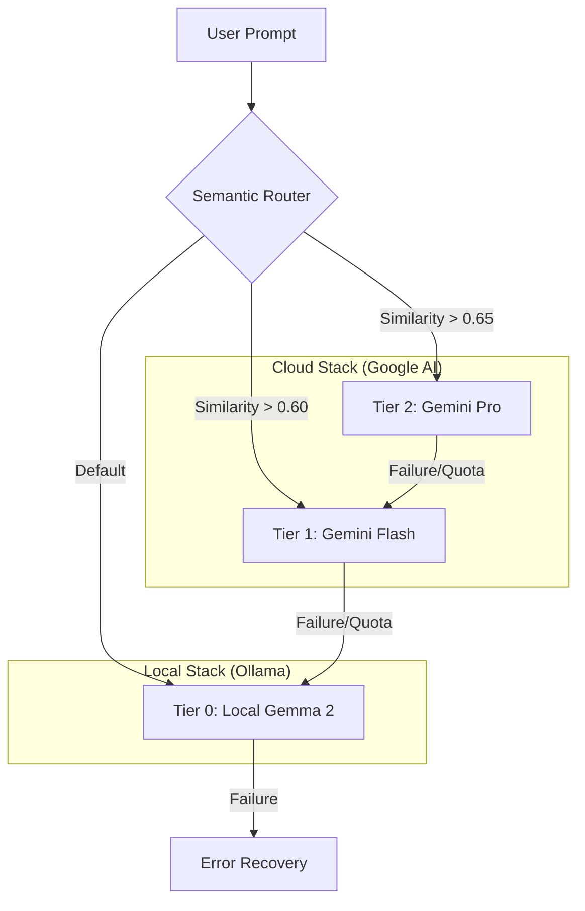

# Hybrid AI Router: Semantic RAG Orchestration 🧠⚡🏠

[](https://opensource.org/licenses/MIT)
[](https://www.python.org/downloads/)

An intelligent, production-grade AI routing engine that dynamically orchestrates tasks between **local LLMs (Gemma 2)** and **cloud providers (Google Gemini)** using Semantic RAG and Vector Embeddings.

---

## 📖 Overview

The **Hybrid AI Router** is designed to maximize cost-efficiency and performance by intelligently delegating tasks. It uses a semantic classifier to understand the complexity of a user prompt and routes it to the most appropriate "tier" of intelligence.

### The Problem
Cloud LLMs (like Gemini Pro) are powerful but expensive and have latency overhead. Local LLMs (like Gemma 2 9B) are fast and free but limited in reasoning depth.

### The Solution: Semantic Tiering
We use **Vector Search (Cosine Similarity)** against "Anchor Vectors" to determine task complexity in real-time.
- **Tier 2 (Pro)**: Complex reasoning, architecture, deep analysis.
- **Tier 1 (Flash)**: Technical tasks, coding, structured data.
- **Tier 0 (Local)**: General queries, greetings, low-stakes text generation.

---

## 🏗️ Architecture



---

## 🚀 Getting Started (Native Windows)

While Docker is supported, for maximum performance and stability on Windows, we recommend the **Native Enterprise Stack**:

### 1. Prerequisites
- [Ollama](https://ollama.com/) (running `gemma2:9b` and `nomic-embed-text`)
- [Python 3.11+](https://www.python.org/downloads/)
- Google Gemini API Key (stored in `secrets/gemini_api_key.txt`)

### 2. Installation
```powershell
git clone https://github.com/your-username/hybrid-ai-router.git
cd hybrid-ai-router
pip install -r requirements.txt
```

### 3. "One-Click" Launch
Simply double-click the included batch files:
1.  **`start_router.bat`**: Boots the Semantic Brain (FastAPI).
2.  **`start_enterprise_system.bat`**: Boots the Open WebUI connected to the Router.

---

## 🔬 Advanced Enterprise Features

### 🕵️‍♂️ Phase 4: Observability Engine
The system includes a deep tracing layer using **SQLite (`traces.db`)**. Every request is logged with latency, model chosen, and a **Faithfulness Score**.
- **Dashboard**: Run `python scripts/generate_dashboard.py` to see your "Bad Answers" report.

### 🎓 Phase 6: Teacher-Student Learning Loop
The system "learns" from flagship models. When a query uses Gemini Flash, the system harvests the **Reasoning Trace** and stores it in the **Logic Library**.
- **Result**: Local Gemma 2 uses these traces as few-shot examples to achieve "Pro-level" reasoning at zero cost.

### 🛡️ Phase 7: Agentic Self-Healing
A background agent monitors system performance and automatically:
- Adjusts routing thresholds based on success rates.
- Updates RAG chunking strategies if retrieval quality drops.
- Notifies the user of model drift via the Governance Ledger.

---

## 🧱 System Constraints & Governance

To ensure production stability and enterprise-grade reliability, this system operates under a strict set of architectural primitives:

### 1. Data Contract (The Input Boundary)
The system exposes an **OpenAI-compatible /v1/chat/completions** endpoint. 
- **Payload Schema**: Strict JSON validation. Malformed payloads trigger 422 errors.
- **Multimodal Logic**: Supports Vision Tier Bypass via base64 images.
- **Hard Bottleneck**: Input is capped at **8,192 tokens**.

### 2. Governance & Truth Protocol
- **Hallucination Guardrails**: Audited by local **Gemma 2 9B (LLM-Judge)**.
- **Cost-Zero Resilience**: 95% similarity match triggers **Semantic Cache** for $0 cost.
- **Failure Fallback**: Deterministic fallback: **Pro → Flash → Local**.

---

## 📜 License
Distributed under the MIT License. See `LICENSE` for more information.

**Built with ❤️ for the future of Local-First AI.**
