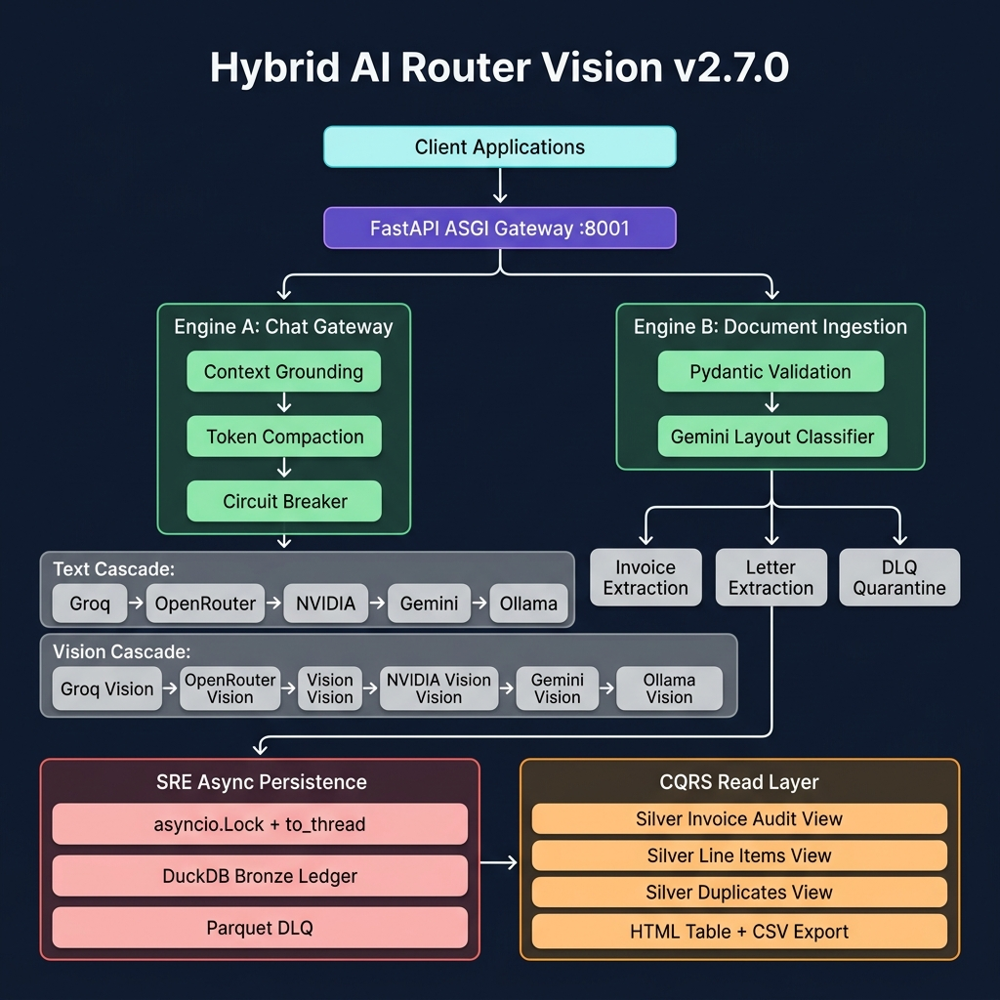
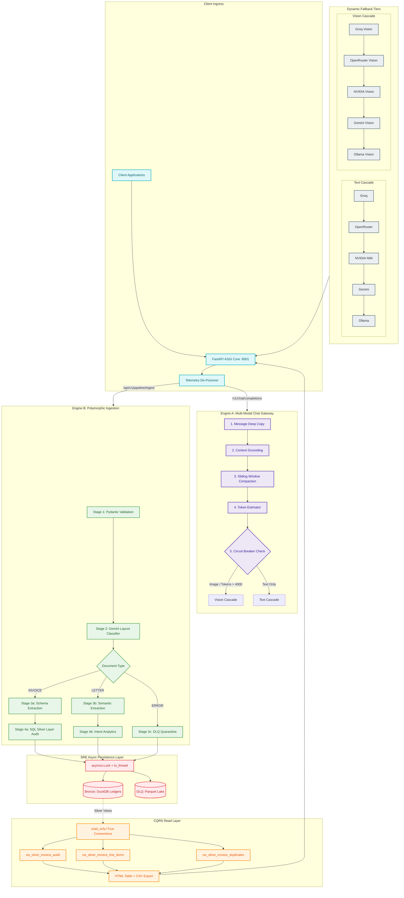

# Hybrid-AI-Router-Vision: The Autonomous Multi-Modal AI Gateway


---

The **Hybrid-AI-Router-Vision** is a next-generation, low-overhead, and high-availability multi-modal AI gateway designed for critical enterprise workflows. It intelligently routes complex vision and text payloads across a dynamic network of LLM providers, ensuring maximum uptime, cost efficiency, and performance. Beyond simple routing, it features an integrated **Polymorphic Ingestion Engine** for automated document classification, structured OCR extraction, and validation.

Built with SRE principles at its core, this system is a testament to resilience, operational rigor, and adaptive architecture. It is engineered to not just process requests, but to **survive** API outages, rate limits, and service degradations with graceful, cascading fallbacks.

---

## Key Features & Capabilities

*   **Autonomous Multi-Modal Routing:** Dynamically detects image payloads and intelligently routes to vision-capable models across multiple providers (Groq, OpenRouter, NVIDIA NIM, Gemini, Ollama).
*   **High-Availability Cascade Fallback:** Implements a robust, real-time fallback mechanism across provider tiers to guarantee service continuity even during external API outages or rate limits.
*   **Polymorphic Ingestion Engine:** A dynamic 4-stage document ingestion pipeline featuring zero-shot document layout classification (`INVOICE` vs `LETTER`), target schema Pydantic generation matrices, deterministic arithmetic audits, and duplicate/history analytics.
*   **CQRS Silver Layer Analytics:** Strict Command Query Responsibility Segregation with DuckDB SQL Silver Layer views for read-time anomaly detection — line item math validation, grand total balance audits, and duplicate invoice detection — all in pure SQL.
*   **Invoice Line Items Visibility:** Full unnested line item detail with per-row arithmetic delta checks, compound vendor/invoice search, and CSV export.
*   **Circuit Breaker Protocol:** A stateful, thread-safe circuit breaker monitors upstream Vision LLM responses. After 3 consecutive 429/503 failures, it trips OPEN, halts outbound requests for a 60-second cooldown, and triggers a DuckDB WAL checkpoint.
*   **SRE Compute Separation:** All blocking I/O (DuckDB writes, Parquet DLQ dumps, database reads) is offloaded to `asyncio.to_thread` worker pools with process-wide locks, maintaining sub-second user response cycles.
*   **Advanced Telemetry & Optimization:** Leverages DuckDB for real-time request analytics, context compaction metrics, and efficiency tracking, all within a minimal memory footprint (256MB capped).
*   **Adaptive Token Management:** Features an intelligent token estimator with a dynamic `+1024` token proxy for Base64 image data, protecting against silent token inflation.
*   **Security-First Design:** Strict isolation of API keys within `secrets/*.txt` with standardized loading logic.

---

## Core Architecture

At its heart, the system operates as a dual-engine architecture, each optimized for its specific domain while sharing a common, resilient infrastructure.



<details>
<summary>Mermaid Source (Machine-Parseable)</summary>


</details>

### 1. Gateway Engine (`POST /v1/chat/completions`)

This endpoint serves as the primary multi-modal AI chat interface, intelligently routing incoming requests to the most suitable LLM provider and model.
*   **Dynamic Vision Cascade Fallback Network:**
    The moment `image_data` is detected within an OpenAI-style payload, the gateway dynamically switches from text-only models to a dedicated Vision Tier. This cascade ensures high availability and cost optimization by attempting providers in a predefined order:
    1.  **Groq Engine:** `llama-3.2-11b-vision-preview`
    2.  **OpenRouter Engine:** `google/gemini-2.5-flash`
    3.  **NVIDIA NIM:** `meta/llama-3.2-90b-vision-instruct`
    4.  **Gemini Engine:** `gemini-2.5-flash`
    5.  **Ollama Local:** `llava:13b`

### 2. Polymorphic Ingestion Engine (`POST /api/v1/pipeline/ingest`)

This specialized engine provides a high-throughput, dual-track document processing pipeline that automatically adapts to the incoming document type (supporting invoices, unstructured letters, and correspondence).
*   **4-Stage Polymorphic Validation & Ingestion Pipeline:**
    1.  **Stage 1: Layout Classification** — Uses Gemini to execute zero-shot document layout taxonomy classification (`INVOICE` vs `LETTER`).
    2.  **Stage 2: Target Schema Extraction** — Triggers Pydantic extraction models with strict types and temperature 0.0.
    3.  **Stage 3: CQRS Silver Layer Analytics** — Ingested into Bronze ledger, then audited at read-time via SQL Silver Layer views.
    4.  **Stage 4: SRE Async Thread Offloading & DLQ Quarantine** — All blocking I/O is serialized and delegated to `asyncio.to_thread` pools with process-wide locks.

### 3. CQRS Read Layer (Silver View Endpoints)

| Endpoint | Purpose | Formats |
|---|---|---|
| `GET /api/v1/pipeline/invoices` | Invoice audit summary | JSON, HTML, CSV, Markdown |
| `GET /api/v1/pipeline/invoices/lines` | Line items detail | JSON, HTML, CSV, Markdown |
| `GET /api/v1/pipeline/anomalies/duplicates` | Duplicate detection | JSON, HTML, CSV, Markdown |

All read endpoints support compound search via `?search_query=` across vendor name and invoice number.

---

## Deep-Dive Documentation & Logs

*   **[Project Forensic Audit & Retrospective](retrospective.md):** The permanent failure log and key learnings for the last 100+ cycles.
*   **[Multi-Modal Vision Cascade Blueprint](implementation_plan.md):** The core SRE architecture blueprints and implementation schemas.
*   **[Dynamic Vision Cascade Walkthrough](walkthrough.md):** An under-the-hood look at the compute separation, CQRS read layer, and SRE guardrails.
*   **[Telemetry & Handoff Standards](HANDOVER.md):** Standard guidelines for metrics compaction, DuckDB schemas, circuit breaker protocol, and CQRS endpoints.

---

## Getting Started

### Prerequisites

*   Python 3.10+
*   `pip` (Python package installer)
*   `ollama` (required if you plan to utilize local models like `llava:13b`)

### 1. Clone the Repository

```bash
git clone https://github.com/hitanshuac/Hybrid-AI-Router-Vision.git
cd Hybrid-AI-Router-Vision
```

### 2. Install Dependencies

```bash
pip install -r requirements.txt
```

### 3. Configure Secrets

Create a `secrets/` directory in the root of your project and place your API keys there as individual `.txt` files.

```
Hybrid-AI-Router-Vision/
├── src/
├── secrets/
│   ├── groq_api_key.txt
│   ├── openrouter_api_key.txt
│   ├── nvidia_api_key.txt
│   ├── gemini_api_key.txt
│   └── ollama_host.txt
└── requirements.txt
```

### 4. Initialize the Silver Layer

```bash
python -c "import duckdb; con = duckdb.connect('data/pipeline_metrics.db'); con.execute(open('data/sql_silver_layer.sql').read()); print('Silver Layer initialized.')"
```

### 5. Run the FastAPI Server

```bash
uvicorn src.server:app --host 0.0.0.0 --port 8001 --reload
```

The server will now be accessible at `http://localhost:8001`. The interactive Swagger UI can be found at `http://localhost:8001/docs`.

### 6. Verification

*   **Dashboard:** `http://localhost:8001/dashboard`
*   **Invoice Audit Table:** `http://localhost:8001/api/v1/pipeline/invoices`
*   **Line Items Detail:** `http://localhost:8001/api/v1/pipeline/invoices/lines`
*   **CSV Export:** Append `?format=csv` to any read endpoint

---

## License

This project is licensed under the MIT License - see the [LICENSE](LICENSE) file for details.