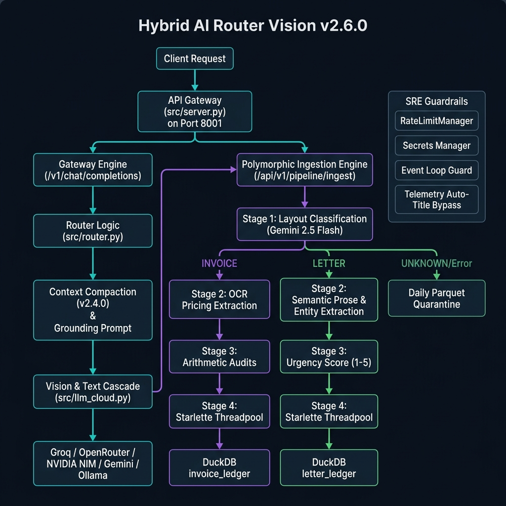
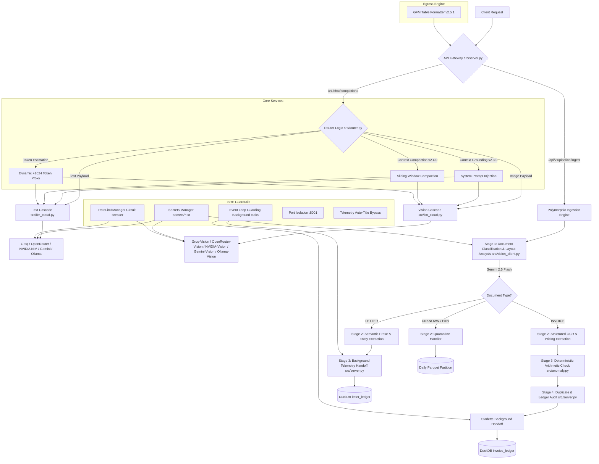

# 🚀 Hybrid-AI-Router-Vision: The Autonomous Multi-Modal AI Gateway


-success)

---

The **Hybrid-AI-Router-Vision** is a next-generation, low-overhead, and high-availability multi-modal AI gateway designed for critical enterprise workflows. It intelligently routes complex vision and text payloads across a dynamic network of LLM providers, ensuring maximum uptime, cost efficiency, and performance. Beyond simple routing, it features an integrated **Polymorphic Ingestion Engine** for automated document classification, structured OCR extraction, and validation.

Built with SRE principles at its core, this system is a testament to resilience, operational rigor, and adaptive architecture. It is engineered to not just process requests, but to **survive** API outages, rate limits, and service degradations with graceful, cascading fallbacks.

---

## ✨ Key Features & Capabilities

*   **Autonomous Multi-Modal Routing:** Dynamically detects image payloads and intelligently routes to vision-capable models across multiple providers (Groq, OpenRouter, NVIDIA NIM, Gemini, Ollama).
*   **High-Availability Cascade Fallback:** Implements a robust, real-time fallback mechanism across provider tiers to guarantee service continuity even during external API outages or rate limits.
*   **Polymorphic Ingestion Engine:** A dynamic 4-stage document ingestion pipeline featuring zero-shot document layout classification (`INVOICE` vs `LETTER`), target schema Pydantic generation matrices, deterministic arithmetic audits, and duplicate/history analytics.
*   **Advanced SRE Telemetry & Optimization:** Leverages DuckDB for real-time request analytics, context compaction metrics, and efficiency tracking, all within a minimal memory footprint (256MB capped).
*   **Ephemeral Context Grounding:** Enforces consistent model persona and behavior by injecting system prompts at the router layer, ensuring zero latency overhead.
*   **Adaptive Token Management:** Features an intelligent token estimator with a dynamic `+1024` token proxy for Base64 image data, protecting against silent token inflation and ensuring circuit breaker accuracy.
*   **Event Loop Guarding:** Protects FastAPI's `async` event loop by offloading synchronous file I/O and database operations to Starlette's background threadpool, eliminating latency spikes.
*   **Zero-Downtime Provider Pivoting:** Seamlessly switches between free and paid tiers, and between different model versions, to maintain cost efficiency and performance.
*   **Security-First Design:** Strict isolation of API keys within `secrets/*.txt` with standardized loading logic.

---

## 🏛️ Core Architecture

At its heart, the system operates as a dual-engine architecture, each optimized for its specific domain while sharing a common, resilient infrastructure.



### 1. 🌐 Gateway Engine (`POST /v1/chat/completions`)

This endpoint serves as the primary multi-modal AI chat interface, intelligently routing incoming requests to the most suitable LLM provider and model.
*   **Dynamic Vision Cascade Fallback Network:**
    The moment `image_data` is detected within an OpenAI-style payload, the gateway dynamically switches from text-only models to a dedicated Vision Tier. This cascade ensures high availability and cost optimization by attempting providers in a predefined order:
    1.  **Groq Engine:** `llama-3.2-11b-vision-preview` (high-speed, cost-effective vision)
    2.  **OpenRouter Engine:** `google/gemini-2.5-flash` (diverse model access, robust fallback)
    3.  **NVIDIA NIM:** `meta/llama-3.2-90b-vision-instruct` (powerful, enterprise-grade vision)
    4.  **Gemini Engine:** `gemini-2.5-flash` (native multi-modal support, reliable)
    5.  **Ollama Local:** `llava:13b` (local fallback for extreme resilience or specific use cases)

### 2. 📝 Polymorphic Ingestion Engine (`POST /api/v1/pipeline/ingest`)

This specialized engine provides a high-throughput, dual-track document processing pipeline that automatically adapts to the incoming document type (supporting invoices, unstructured letters, and correspondence).
*   **4-Stage Polymorphic Validation & Ingestion Pipeline:**
    1.  **Stage 1: Layout Classification ([src/vision_client.py](src/vision_client.py)):** Uses `gemini-2.5-flash` to execute zero-shot document layout taxonomy classification, dividing payloads into structured tabular pricing grids (`INVOICE`) or unstructured prose texts (`LETTER`).
    2.  **Stage 2: Target Schema Generation Matrices ([src/vision_client.py](src/vision_client.py)):** Triggers target schema Pydantic extraction models (with strict types and temperature 0.0) mapping either complex invoice tables or letters (sender/recipient details, urgency scores 1-5, and intent analytics).
    3.  **Stage 3: Adaptive Audits & Analytics ([src/anomaly.py](src/anomaly.py)):** 
        - **Invoices:** Pass through deterministic mathematical arithmetic audits, checking sub-totals, tax matrices, duplicate IDs, and historical DuckDB ledger collisions.
        - **Letters:** Skips numeric calculation loops, routing semantic intent indices directly to Starlette background thread queues.
    4.  **Stage 4: Starlette Background Thread Offloading & Quarantine:** Any blocking filesystem I/O, parquet writes, or DuckDB updates are delegated to a Starlette background pool, maintaining sub-second user response cycles. Processing failures are auto-routed to daily partitioned quarantine Parquet files.

---

## 📑 Deep-Dive Documentation & Logs

To keep the repository clean and avoid massive walls of text, we maintain comprehensive modular documentation. Click the links below for a deep dive into each system:

*   🔍 **[Project Forensic Audit & Retrospective](retrospective.md):** The permanent failure log and key learnings for the last 100+ cycles, documenting every major cloud outage, event loop blockade, and system fix.
*   🗺️ **[Multi-Modal Vision Cascade Blueprint](implementation_plan.md):** The core SRE architecture blueprints and implementation schemas for routing payloads across multi-provider endpoints.
*   🌊 **[Dynamic Vision Cascade Walkthrough](walkthrough.md):** An under-the-hood look at ingress preservation, recursive token estimation, and ternary-based provider hydration.
*   🤝 **[Telemetry & Telemetry Handoff Standards](HANDOVER.md):** Standard guidelines for metrics compaction, DuckDB schemas, and multi-agent governance parameters.

---

## 🛠️ Getting Started

Follow these steps to get your Hybrid-AI-Router-Vision up and running.

### Prerequisites

*   Python 3.10+
*   `pip` (Python package installer)
*   `ollama` (required if you plan to utilize local models like `llava:13b`)

### 1. Clone the Repository

```bash
git clone https://github.com/hitanshuac/Hybrid-AI-Router-Vision.git
cd Hybrid-AI-Router-Vision
```

### 2. Install Dependencies

```bash
pip install -r requirements.txt
```

### 3. Configure Secrets

Create a `secrets/` directory in the root of your project and place your API keys there as individual `.txt` files. Each file should contain only the key.
Example directory structure:

```
Hybrid-AI-Router-Vision/
├── src/
├── secrets/
│   ├── groq_api_key.txt
│   ├── openrouter_api_key.txt
│   ├── nvidia_api_key.txt
│   ├── gemini_api_key.txt
│   └── ollama_host.txt (e.g., http://localhost:11434)
└── requirements.txt
```

### 4. Run the FastAPI Server with Uvicorn

```bash
uvicorn src.server:app --host 0.0.0.0 --port 8001 --reload
```
The server will now be accessible at `http://localhost:8001`. The interactive Swagger UI for API documentation can be found at `http://localhost:8001/docs`.

### 5. Verification and Diagnostics

*   **Test Multi-Modal Routing:**
    Send an image alongside text via standard chat completition endpoint. Monitor your console logs to verify that the request successfully routes to a vision model (e.g., `llama-3.2-11b-vision-preview`) and returns OCR/transcribed text instead of ignoring the image.
*   **Invoice Ingest Test:**
    Send a `POST` request to `/api/v1/pipeline/ingest` with a structured invoice image inside `InvoiceIngress` payload body. Observe the logs to trace the execution of the 4-stage validation pipeline and the resulting audited data.

---

## 📄 License

This project is licensed under the MIT License - see the [LICENSE](LICENSE) file for details.

---

## 🗺️ System Flowchart (Mermaid Source)

The following raw Mermaid diagram governs the visual representation of our gateway and invoice pipeline. It is automatically parsed and compiled by our automation workflows whenever a new version is pushed to GitHub.

