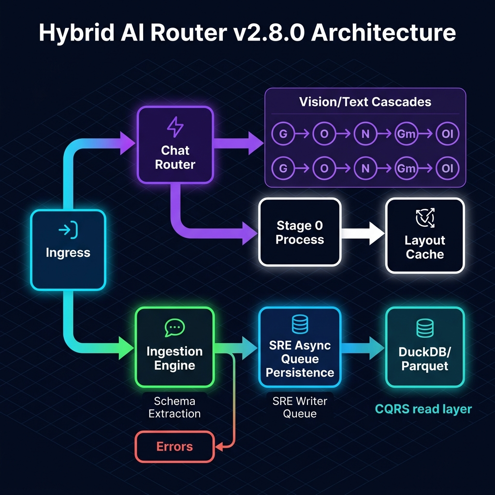

# Hybrid-AI-Router-Vision: The Autonomous Multi-Modal AI Gateway


---

The **Hybrid-AI-Router-Vision** is a next-generation, low-overhead, and high-availability multi-modal AI gateway designed for critical enterprise workflows. It intelligently routes complex vision and text payloads across a dynamic network of LLM providers, ensuring maximum uptime, cost efficiency, and performance. Beyond simple routing, it features an integrated **Polymorphic Ingestion Engine** for automated document classification, structured OCR extraction, and validation.

Built with SRE principles at its core, this system is a testament to resilience, operational rigor, and adaptive architecture. It is engineered to not just process requests, but to **survive** API outages, rate limits, and service degradations with graceful, cascading fallbacks.

---

## Key Features & Capabilities

*   **Autonomous Multi-Modal Routing:** Dynamically detects image payloads and intelligently routes to vision-capable models across multiple providers (Groq, OpenRouter, NVIDIA NIM, Gemini, Ollama).
*   **High-Availability Cascade Fallback:** Implements a robust, real-time fallback mechanism across provider tiers to guarantee service continuity even during external API outages or rate limits.
*   **Zero-Cost Structural Layout Cache (Stage 0):** Computes a deterministic SHA-256 structural fingerprint based on document text anchors. Bypasses LLM classification completely on recurring layouts, saving 100% of LLM classification costs.
*   **Polymorphic Ingestion Engine (5-Stage):** A dynamic 5-stage pipeline featuring layout cache pre-flight checking, zero-shot layout taxonomy classification, target schema extraction, deterministic SQL audits, and async queue persistence.
*   **CQRS Silver Layer Analytics:** Strict Command Query Responsibility Segregation with DuckDB SQL Silver Layer views for read-time anomaly detection — line item math validation, grand total balance audits, and duplicate invoice detection — all in pure SQL.
*   **Invoice Line Items Visibility:** Full unnested line item detail with per-row arithmetic delta checks, compound vendor/invoice search, and CSV export.
*   **3-State Canary Circuit Breaker:** Stateful circuit breaker guarding upstream Vision LLM requests. It transitions from CLOSED → OPEN after 3 consecutive failures, respects Retry-After header cooldowns, and routes a single canary request in HALF_OPEN to safely re-verify upstream health without thundering herd stampedes.
*   **SRE Lock-Free Persistence Queue:** All blocking I/O (DuckDB writes, Parquet DLQ dumps, database reads) is decoupled from the main ASGI event loop via an `asyncio.Queue` (maxsize=1000) drained by a single-writer background actor thread, yielding O(1) lock contention.
*   **Automated Pre-Flight Verification Gate:** Comprehensive unit and integration test suite (`tests/eval_system.py`) integrated as a blocking startup check via `start_all.bat --eval`.
*   **Adaptive Token Management:** Features an intelligent token estimator with a dynamic `+1024` token proxy for Base64 image data, protecting against silent token inflation.
*   **Security-First Design:** Strict isolation of API keys within `secrets/*.txt` with standardized loading logic.

---

## Core Architecture

At its heart, the system operates as a dual-engine architecture, each optimized for its specific domain while sharing a common, resilient infrastructure.



<details>
<summary>Mermaid Source</summary>

```mermaid
flowchart TD
    classDef client fill:#0A192F,stroke:#00F0FF,stroke-width:2px,color:#00F0FF
    classDef gate fill:#170F1C,stroke:#B5179E,stroke-width:2px,color:#B5179E
    classDef engine fill:#0F1C11,stroke:#39FF14,stroke-width:2px,color:#39FF14
    classDef provider fill:#1E293B,stroke:#F72585,stroke-width:2px,color:#F72585
    classDef db fill:#1C0A0D,stroke:#FF073A,stroke-width:2px,color:#FF073A
    classDef breaker fill:#1F190F,stroke:#FF9F1C,stroke-width:2px,color:#FF9F1C

    subgraph Ingress ["Client Ingress Layer"]
        direction TB
        Client["Client Applications"]
        APIGateway["FastAPI Core :8001"]
        DePoison["Telemetry De-Poisoner"]
        Client --> APIGateway --> DePoison
    end

    DePoison -->|"/v1/chat/completions"| ChatRouter
    DePoison -->|"/api/v1/pipeline/ingest"| IngestionEngine

    subgraph ChatRouter ["Engine A: Multi-Modal Chat Gateway"]
        direction TB
        DeepCopy["1. Message Deep Copy"] -->
        Grounding["2. Context Grounding"] -->
        Compaction["3. Sliding Window Compaction"] -->
        TokenEst["4. Token Estimator"] -->
        CB_Check{"5. 3-State Circuit Breaker Check"}
        
        CB_Check -->|"CLOSED / HALF_OPEN (Canary)"| RouteCascade{"Route Payload"}
        CB_Check -->|"OPEN (Blocked)"| FastFail["Fast Fail / Retry-After"]
        
        RouteCascade -->|"Image / High Context"| VisionTier["Vision Cascade"]
        RouteCascade -->|"Text Only"| TextTier["Text Cascade"]
    end

    subgraph Cascades ["Dynamic Fallback Tiers"]
        direction LR
        subgraph TextFallback ["Text Cascade"]
            T1["Groq (L3.3)"] --> T2["OpenRouter (G4)"] --> T3["NVIDIA (L3.1)"] --> T4["Gemini (G2.5)"] --> T5["Ollama (G2)"]
        end
        subgraph VisionFallback ["Vision Cascade"]
            V1["Groq Vision (L3.2)"] --> V2["OpenRouter Vision (G2.5)"] --> V3["NVIDIA Vision (L3.2)"] --> V4["Gemini Vision (G2.5)"] --> V5["Ollama Vision (Llava)"]
        end
    end

    subgraph IngestionEngine ["Engine B: Polymorphic Ingestion Engine"]
        direction TB
        Pydantic["Stage 1: Pydantic Validation"] -->
        CacheCheck{"Stage 2: Layout Cache Check"}
        
        CacheCheck -->|"Cache HIT ($0 cost)"| DocFork{"Document Type"}
        CacheCheck -->|"Cache MISS"| Classifier["Stage 3: Gemini Classifier"]
        Classifier --> DocFork
        
        DocFork -->|"INVOICE"| InvExtract["Stage 4a: Schema Extraction"]
        InvExtract --> SilverAudit["Stage 5a: SQL Silver Layer Audit"]
        
        DocFork -->|"LETTER"| LetExtract["Stage 4b: Semantic Extraction"]
        LetExtract --> IntentAudit["Stage 5b: Intent Analytics"]
        
        DocFork -->|"ERROR"| DLQ["Stage 4c: DLQ Quarantine"]
    end

    subgraph Persistence ["SRE Async Persistence Layer (Single-Writer Actor)"]
        direction TB
        AsyncQueue["asyncio.Queue (maxsize=1000)"]
        WriterTask["Background Writer Task"]
        BronzeDB[("Bronze: DuckDB Ledgers")]
        DLQParquet[("DLQ: Parquet Lake")]
        
        AsyncQueue -->|O(1) Drainage| WriterTask
        WriterTask -->|Atomic Commit| BronzeDB
        WriterTask -->|Atomic Append| DLQParquet
    end

    subgraph CQRS ["CQRS Read Layer (Analytical)"]
        direction TB
        ReadOnlyConn["duckdb.connect(read_only=False)"]
        AuditView["vw_silver_invoice_audit"]
        LinesView["vw_silver_invoice_line_items"]
        DupsView["vw_silver_invoice_duplicates"]
        
        ReadOnlyConn --> AuditView
        ReadOnlyConn --> LinesView
        ReadOnlyConn --> DupsView
        
        AuditView --> HTMLTable["HTML Dashboard + CSV Export"]
        LinesView --> HTMLTable
        DupsView --> HTMLTable
    end

    SilverAudit -->|Enqueue| AsyncQueue
    IntentAudit -->|Enqueue| AsyncQueue
    DLQ -->|Enqueue| AsyncQueue
    
    Classifier -.->|Async Cache Store| AsyncQueue
    
    BronzeDB -.->|"Silver Views (Read-time)"| ReadOnlyConn

    Cascades --> APIGateway
    HTMLTable --> APIGateway

    class Client,APIGateway,DePoison client
    class DeepCopy,Grounding,Compaction,TokenEst,CB_Check,FastFail,RouteCascade gate
    class T1,T2,T3,T4,T5,V1,V2,V3,V4,V5 provider
    class Pydantic,CacheCheck,Classifier,DocFork,InvExtract,SilverAudit,LetExtract,IntentAudit,DLQ engine
    class AsyncQueue,WriterTask,BronzeDB,DLQParquet db
    class ReadOnlyConn,AuditView,LinesView,DupsView,HTMLTable breaker
```
</details>

### 1. Gateway Engine (`POST /v1/chat/completions`)

This endpoint serves as the primary multi-modal AI chat interface, intelligently routing incoming requests to the most suitable LLM provider and model.
*   **Dynamic Vision Cascade Fallback Network:**
    The moment `image_data` is detected within an OpenAI-style payload, the gateway dynamically switches from text-only models to a dedicated Vision Tier. This cascade ensures high availability and cost optimization by attempting providers in a predefined order:
    1.  **Groq Engine:** `llama-3.2-11b-vision-preview` (When available)
    2.  **Gemini Tier:** `gemini-2.5-flash`
    3.  **OpenRouter Free Tier:** `openrouter/free` (Auto-routing to any available free vision model)
    4.  **NVIDIA NIM:** `meta/llama-3.2-90b-vision-instruct`

### 2. Polymorphic Ingestion Engine (`POST /api/v1/pipeline/ingest`)

This specialized engine provides a high-throughput, dual-track document processing pipeline that automatically adapts to the incoming document type (supporting invoices, unstructured letters, and correspondence).
*   **5-Stage Polymorphic Validation & Ingestion Pipeline:**
    1.  **Stage 0: Layout Cache pre-flight check** — Computes deterministic structural layout SHA-256 hash. Bypasses LLM classification entirely if confidence match exists.
    2.  **Stage 1: Layout Classification** — Uses Gemini to execute zero-shot document layout taxonomy classification (`INVOICE` vs `LETTER`) on layout cache MISS.
    3.  **Stage 2: Target Schema Extraction** — Triggers Pydantic extraction models with strict types and temperature 0.0.
    4.  **Stage 3: CQRS Silver Layer Analytics** — Ingested into Bronze ledger, then audited at read-time via SQL Silver Layer views.
    5.  **Stage 4: SRE Async Queue Ingestion & DLQ Quarantine** — All writes enqueued to `asyncio.Queue` and committed lock-free by a background single-writer thread. Failed payloads routed to Parquet DLQ.

### 3. CQRS Read Layer (Silver View Endpoints)

| Endpoint | Purpose | Formats |
|---|---|---|
| `GET /api/v1/pipeline/invoices` | Invoice audit summary | JSON, HTML, CSV, Markdown |
| `GET /api/v1/pipeline/invoices/lines` | Line items detail | JSON, HTML, CSV, Markdown |
| `GET /api/v1/pipeline/anomalies/duplicates` | Duplicate detection | JSON, HTML, CSV, Markdown |

All read endpoints support compound search via `?search_query=` across vendor name and invoice number.

---

## Deep-Dive Documentation & Logs

*   **[Project Forensic Audit & Retrospective](retrospective.md):** The permanent failure log and key learnings for the last 100+ cycles.
*   **[Multi-Modal Vision Cascade Blueprint](implementation_plan.md):** The core SRE architecture blueprints and implementation schemas.
*   **[Dynamic Vision Cascade Walkthrough](walkthrough.md):** An under-the-hood look at the compute separation, CQRS read layer, and SRE guardrails.
*   **[Telemetry & Handoff Standards](HANDOVER.md):** Standard guidelines for metrics compaction, DuckDB schemas, circuit breaker protocol, and CQRS endpoints.

---

## Getting Started

### Prerequisites

*   Python 3.10+
*   `pip` (Python package installer)

### 1. Clone the Repository

```bash
git clone https://github.com/hitanshuac/Hybrid-AI-Router-Vision.git
cd Hybrid-AI-Router-Vision
```

### 2. Install Dependencies

```bash
pip install -r requirements.txt
```

### 3. Configure Secrets

Create a `secrets/` directory in the root of your project and place your API keys there as individual `.txt` files.

```
Hybrid-AI-Router-Vision/
├── src/
├── secrets/
│   ├── groq_api_key.txt
│   ├── openrouter_api_key.txt
│   ├── nvidia_api_key.txt
│   └── gemini_api_key.txt
└── requirements.txt
```

### 4. Initialize the Silver Layer

```bash
python -c "import duckdb; con = duckdb.connect('data/pipeline_metrics.db'); con.execute(open('data/sql_silver_layer.sql').read()); print('Silver Layer initialized.')"
```

### 5. Run the Server

**For Server Deployment (Recommended):**
```bash
docker-compose up -d --build
```
The FastAPI backend and Open WebUI will be automatically orchestrated.

**For Local Testing:**
```bash
uvicorn src.server:app --host 0.0.0.0 --port 8001
```

The server will be accessible at `http://localhost:8001`. The interactive Swagger UI can be found at `http://localhost:8001/docs`.

### 6. Verification

*   **Dashboard:** `http://localhost:8001/dashboard`
*   **Invoice Audit Table:** `http://localhost:8001/api/v1/pipeline/invoices`
*   **Line Items Detail:** `http://localhost:8001/api/v1/pipeline/invoices/lines`
*   **CSV Export:** Append `?format=csv` to any read endpoint

---

## License

This project is licensed under the MIT License - see the [LICENSE](LICENSE) file for details.