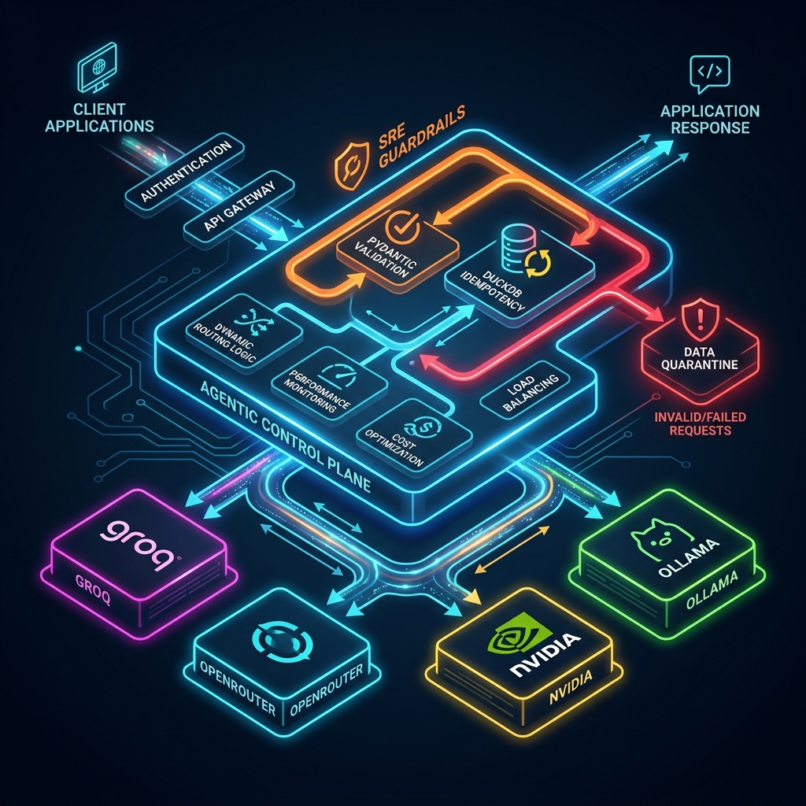
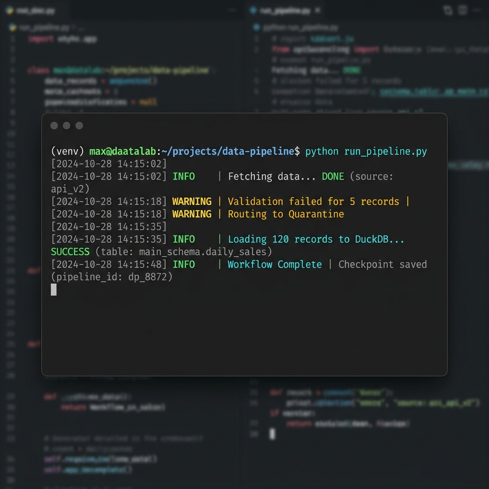

# 🚀 Hybrid AI Router: Agentic Pipeline (v2.2.0-pipeline)

A production-grade, SRE-focused API Gateway and Data Engineering pipeline. This system maximizes cloud resilience through a multi-provider waterfall cascade and maintains absolute data integrity using an autonomous Agentic Operating System.

---

## 🛠️ System Architecture
Built for **Bulletproof Reliability**, the system decouples complex logic from core routing and enforces strict SRE guardrails via the **Agentic Control Plane**.

### 1. The Waterfall Cascade
Ensures 99.9% uptime by automatically pivoting between providers:
1.  **Groq (Primary)**: Ultra-fast inference (`llama-3.3-70b`).
2.  **OpenRouter (Fallback)**: Diverse provider safety net (`gemma-4-free`).
3.  **NVIDIA NIM (Safety Net)**: High-reliability fallback (`llama-3.1-8b`).
4.  **Ollama (Offline)**: Local private execution (`gemma2:9b`).

### 2. The Agentic Control Plane
The `.agents/` directory functions as the system's "Brain," governing data engineering and pipeline operations:
- **Autonomous Rules**: Enforces **DuckDB Idempotency** (no duplicate rows) and **Pydantic Fault Tolerance** (quarantining bad data to `.parquet` instead of crashing).
- **Specialized Skills**: The `pipeline-architect` (minimalism) and `duckdb-optimizer` (WAL + memory safety) ensure the system remains lean and stable.
- **Resilient Workflows**: Standardized paths for `daily-ingestion` and emergency `error-recovery` circuit breakers.

---

## 🚀 First-Run Setup (The "Login")

### 1. Configure Secrets
Add your API keys to the `secrets/` directory:
- `secrets/groq_api_key_1.txt`
- `secrets/openrouter_api_key_1.txt`
- `secrets/nvidia_api_key_1.txt`

### 2. Launch System
- **`start_all.bat`**: Boots the Production Server and Dashboard.
- **`src/daily_ingestion.py`**: Triggers the agentic data pipeline.

### 3. Verify Dashboard
Visit **[http://localhost:8000/dashboard](http://localhost:8000/dashboard)** to monitor active key pools and system health.

---

## 🧠 SRE Guardrails & Data Integrity
- **Idempotent Ingestion**: All data writes use `INSERT OR REPLACE` to ensure retries never result in duplicate metrics.
- **Automatic Quarantine**: Malformed data is caught by Pydantic and isolated to `data/quarantine_*.parquet` for manual audit.
- **Memory Safety**: DuckDB is strictly capped at 2GB RAM with Write-Ahead Logging (WAL) enabled to prevent OOM crashes and data loss.
- **Circuit Breakers**: The system halts and checkpoints database state after 3 consecutive 429/503 errors.

---

## 🔍 Project Forensic Audit
This repository maintains a **[RETROSPECTIVE.md](RETROSPECTIVE.md)**—a "Hard Memory" log of every critical failure, its resolution, and the lessons learned. We treat complexity as debt and every failure as a protocol update.

---

**Built for Engineering Resilience. No Complexity. No Hallucinations. Just Uptime.**
