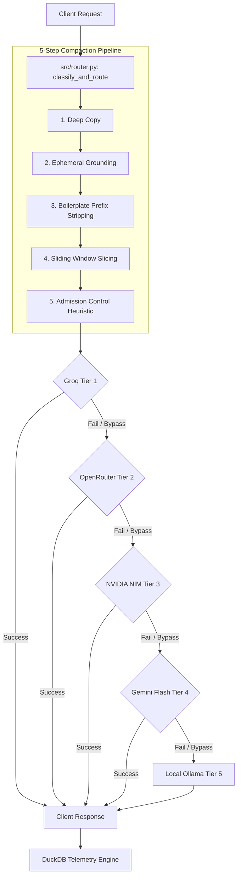

# 🚀 Hybrid AI Router: Agentic Pipeline (v2.4.0)

A high-performance, SRE-grade API Gateway and Data Engineering pipeline. This system maximizes cloud resilience through a multi-provider waterfall cascade, enforces strict behavioral personas, and maintains absolute data integrity and token efficiency via a dedicated **Telemetry & Compaction Plane**.

---

## 🛠️ System Architecture

Built for **Bulletproof Reliability**, the system enforces strict SRE guardrails via the **Agentic Control Plane** and handles payloads through an optimized, zero-overhead execution pipeline.




### The 5-Step Compaction & Routing Sequence
Every request array flowing through the gateway is processed through five immutable stages to eliminate context drift and minimize token wastage:

1. **Deep Copy**: Deep copies incoming message payloads, ensuring caller data is never mutated.
2. **Grounding**: Ephemerally injects the canonical `SYSTEM_GROUNDING_PROMPT` at index 0 of every outbound payload.
3. **Prefix Stripping**: Scans and strips 11 common AI conversational filler prefixes (e.g., `"Sure! "`, `"Great question! "`) from assistant history messages.
4. **Sliding Window**: Enforces a strict **10-message sliding window cap** (retaining index 0's grounding prompt and the 9 most recent turns) to prevent payload bloat.
5. **Admission Control**: Evaluates the payload using a pre-flight heuristic (`len(prompt) // 4`). If the estimated tokens exceed a provider's limit, the model is instantly bypassed locally, preventing network latency and `400 Bad Request` exceptions.

---

## 📊 Real-Time SRE Telemetry Mandate

To guarantee operational transparency and prevent architectural guesswork, the router enforces a strict **Telemetry Mandate** running on the request hot path.

### 1. DuckDB Telemetry Ingestion
Every completion logs comprehensive metrics directly to a local high-performance DuckDB instance (`data/pipeline_metrics.db`):
- **Token Efficiency tracking**: Evaluates `raw_tokens`, `compact_tokens`, total `tokens_saved`, and `savings_pct`.
- **Structural offsets**: Logs `messages_dropped` and `prefixes_stripped`.
- **System latency**: Captures request `latency_sec` and the successfully resolving cascade `tier`.
- **DuckDB Optimizer configuration**: The DB connection runs with Write-Ahead Logging (WAL) enabled and is strictly capped at a `256MB` RAM limit (`PRAGMA memory_limit='256MB'`) to guarantee memory safety.

### 2. Live Efficiency Endpoint
The system exposes real-time telemetry metrics via:
* **`GET /api/v1/metrics/efficiency`**: Returns aggregated pipeline statistics (total savings, average savings %, average latency) and a log of the last 10 requests.

### 3. Fail-Safe Quarantining Protocols
In accordance with our strict data engineering standards:
- **Non-Blocking Validation**: Pydantic schemas validate all payloads without blockages.
- **Parquet Quarantine Isolation**: Any corrupted or malformed data that fails schema validation is immediately caught and routed to isolated `data/quarantine_*.parquet` files. This isolates bad records without interrupting active pipeline ingestion or raising uncaught runtime exceptions.


---

## 🚀 First-Run Setup (The "Login")

### 1. Configure Secrets
Provide API keys in the `secrets/` directory:
- `secrets/groq_api_key.txt`
- `secrets/openrouter_api_key.txt`
- `secrets/nvidia_api_key.txt`
- `secrets/gemini_api_key.txt`

### 2. Launch System
- **`start_all.bat`**: Boots the Production FastAPI Server, Telemetry Dashboard, and Open WebUI instance.
- **`docker-compose up`**: Alternately orchestrates the entire ecosystem in Docker containers.
- **`src/tests/eval_baseline.py`**: Runs baseline performance evaluations, verifying the cascade, overflow pre-flight checks, and compaction logic.

### 3. Open WebUI Login (The Face)
To interact with the router via a sleek ChatGPT-like conversational interface:
- **WebUI Interface**: Navigate to **[http://localhost:8080](http://localhost:8080)** (or **[http://localhost:3000](http://localhost:3000)** if running via Docker Compose).
- **Account Setup**: If launching for the first time, click **Sign Up** to create your local admin login credentials (this runs fully locally on your machine).
- **LLM Pipeline Connection**: The WebUI is pre-configured to communicate with the router's backend API base URL **`http://localhost:8000/v1`**. *Note: Opening `http://localhost:8000/v1` directly in a browser is expected to return a backend details response, as it is a headless API connection point for client libraries.*

### 4. Monitor Efficiency & Telemetry
- **Live SRE Dashboard (User-Facing)**: Open **[http://localhost:8000/dashboard](http://localhost:8000/dashboard)** (or simply **[http://localhost:8000](http://localhost:8000)**) in your browser. This displays a beautiful real-time UI mapping the status of your API key pools, provider latencies, and request counts.
- **Telemetry API (Raw JSON)**: Query **`http://localhost:8000/api/v1/metrics/efficiency`**. *Note: Opening this in a browser displays a raw JSON telemetry payload containing compaction statistics, tokens saved, and logs from the DuckDB instance.*
```bash
curl http://localhost:8000/api/v1/metrics/efficiency
```


---

## 🔍 Project Forensic Audit
This repository maintains an active **[RETROSPECTIVE.md](retrospective.md)**—a comprehensive historical log of all failures, architectural pivots, and core systems-engineering lessons. Complexity is treated as debt; all failures inform a permanent protocol update.

---

**Built for Engineering Resilience. No Complexity. Pure Telemetry. Maximum Uptime.**
