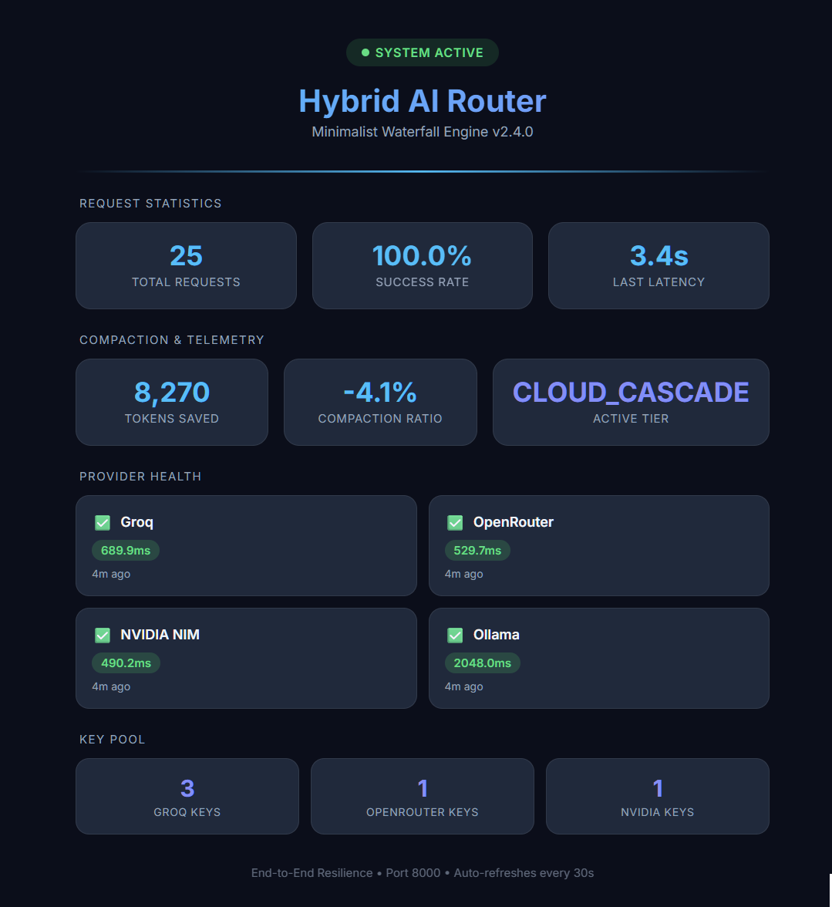
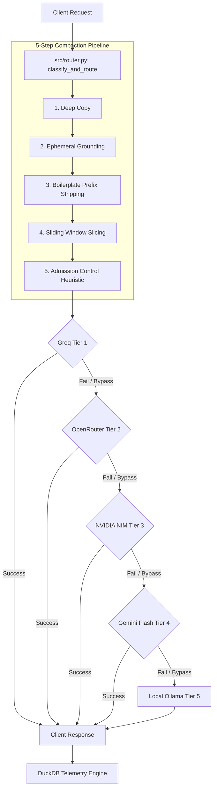

# 🚀 Hybrid AI Router: Multi-Modal Vision Core (v1.0.0 Stable)

A low-overhead API Gateway and Automated Inspection pipeline engineered for absolute cloud resilience. This service runs a dual-mode engine: high-throughput $O(1)$ text/multimodal routing cascades alongside a deterministic data pipeline optimized for sub-second document analysis.

---

## 🛠️ Unified System Topology

1. **Gateway Engine (`POST /v1/chat/completions`)**
   - Implements an adaptive multi-modal sniffer that catches Base64 input matrices.
   - Routes text requests natively to Groq tiers while scaling image payloads across an automated fallback cluster:
     `Groq Vision` ➔ `OpenRouter (Gemini 1.5)` ➔ `NVIDIA NIM` ➔ `Gemini API (Native)` ➔ `Local Ollama`
   - Pre-flight admission controls run strict fallback circuit breaks based on a `+1024` token vision weight protection matrix.

2. **Challan Anomaly Detection Engine (`POST /api/v1/pipeline/ingest`)**
   - High-fidelity structured JSON matching using Gemini 1.5 Flash at the edge.
   - Pushes raw extractions into a completely local, deterministic Python arithmetic audit loop to catch item skews, calculation drift, and ledger collisions.
   - Operates with zero main-thread loop blocking via Starlette background worker threads.

---

## 🛡️ SRE Core Governance

All agent transformations are strictly bound to our localized workflow rulebooks:
- **`sql-standards.md`**: Guarantees absolute write idempotency via `INSERT OR REPLACE` tasks.
- **`data-validation.md`**: Enforces system resilience. Errant formats drop instantly into `data/quarantine_*.parquet` stores without interrupting availability metrics.

---

## 🚀 First-Run Setup (The "Login")

### 1. Configure Secrets
Provide API keys in the `secrets/` directory:
- `secrets/groq_api_key.txt`
- `secrets/openrouter_api_key.txt`
- `secrets/nvidia_api_key.txt`
- `secrets/gemini_api_key.txt`

### 2. Launch System
- **`start_all.bat`**: Boots the Production FastAPI Server, Telemetry Dashboard, and Open WebUI instance.
- **`docker-compose up`**: Alternately orchestrates the entire ecosystem in Docker containers.
- **`src/tests/eval_baseline.py`**: Runs baseline performance evaluations, verifying the cascade, overflow pre-flight checks, and compaction logic.

### 3. Open WebUI Login (The Face)
To interact with the router via a sleek ChatGPT-like conversational interface:
- **WebUI Interface**: Navigate to **[http://localhost:8080](http://localhost:8080)** (or **[http://localhost:3000](http://localhost:3000)** if running via Docker Compose).
- **Account Setup**: If launching for the first time, click **Sign Up** to create your local admin login credentials (this runs fully locally on your machine).
- **LLM Pipeline Connection**: The WebUI is pre-configured to communicate with the router's backend API base URL **`http://localhost:8000/v1`**. *Note: Opening `http://localhost:8000/v1` directly in a browser is expected to return a backend details response, as it is a headless API connection point for client libraries.*

### 4. Monitor Efficiency & Telemetry
- **Live SRE Dashboard (User-Facing)**: Open **[http://localhost:8000/dashboard](http://localhost:8000/dashboard)** (or simply **[http://localhost:8000](http://localhost:8000)**) in your browser. This displays a beautiful real-time UI mapping the status of your API key pools, provider latencies, and request counts.
- **Telemetry API (Raw JSON)**: Query **`http://localhost:8000/api/v1/metrics/efficiency`**. *Note: Opening this URL directly in a web browser will automatically redirect you to the visual `/dashboard` due to HTTP Content Negotiation. To retrieve the raw JSON, query it programmatically or via a CLI tool like `curl`.*
```bash
curl http://localhost:8000/api/v1/metrics/efficiency
```



---

## 🔍 Project Forensic Audit
This repository maintains an active **[RETROSPECTIVE.md](retrospective.md)**—a comprehensive historical log of all failures, architectural pivots, and core systems-engineering lessons. Complexity is treated as debt; all failures inform a permanent protocol update.

---

**Built for Engineering Resilience. No Complexity. Pure Telemetry. Maximum Uptime.**

---

## 🗺️ System Interaction & Flow



